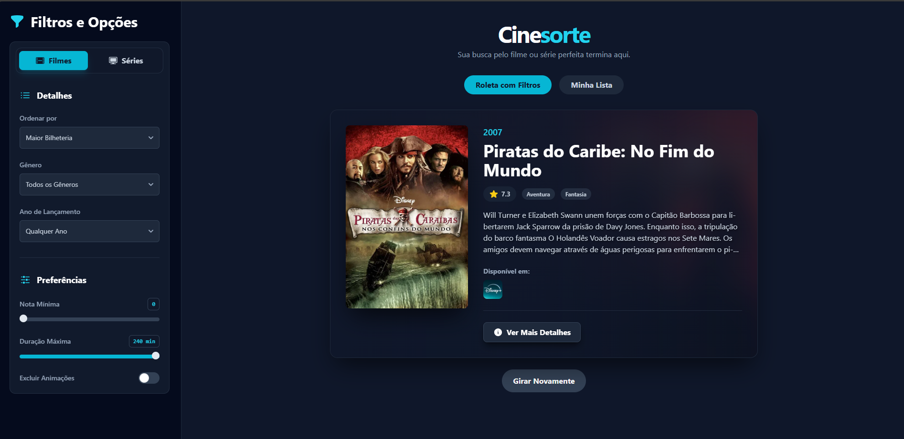

# CineSorte 🎬

Welcome to CineSorte! A modern web application designed to solve the eternal problem of "what to watch next?" Through a customizable filter wheel and personal list management, CineSorte helps users discover movies and series in a fun and intuitive way.

---

## ✨ Main Features

* **Filter Wheel:** Don't know what to watch? Adjust filters like genre, release year, minimum rating, and maximum duration, and let CineSorte choose for you.
* **Custom Lists:** Create and manage your own lists of movies and series. Perfect for organizing your "Favorites," "To Watch Later," or any other category you desire. * **Wheel in Your Lists:** Feeling indecisive even with your list ready? Spin the wheel within your own list and receive a random suggestion from among your favorites.
* **Detailed Information:** Access complete detail pages for any film or series, with information on synopsis, main cast, production team, budget, revenue, and where to watch (streaming services).
* **User Authentication:** A secure registration and login system so your lists are saved to your account and accessible at any time.
* **Modern and Responsive Design:** An elegant and fully responsive interface, built with Tailwind CSS, provides a flawless user experience on any device, be it a computer, tablet, or mobile phone.

---

## 🛠️ Technologies Used

This project was built with a modern architecture, clearly separating responsibilities between the frontend and backend.

### Frontend
* **React:** Core library for building the user interface.
* **Custom Hooks:** All business logic (API calls, state management) is encapsulated in hooks to keep components clean and design-focused.
* **Tailwind CSS:** Utility-first CSS framework for fast, modern, and responsive styling.
* **Axios:** HTTP client for making calls to the backend API.
* **Heroicons:** Library of high-quality SVG icons.

### Backend
* **Node.js & Express:** Runtime environment and framework for building the REST API.
* **CORS:** Middleware to enable secure communication between the frontend and backend.
* **The Movie Database (TMDb) API:** External source for all movie and TV show data.